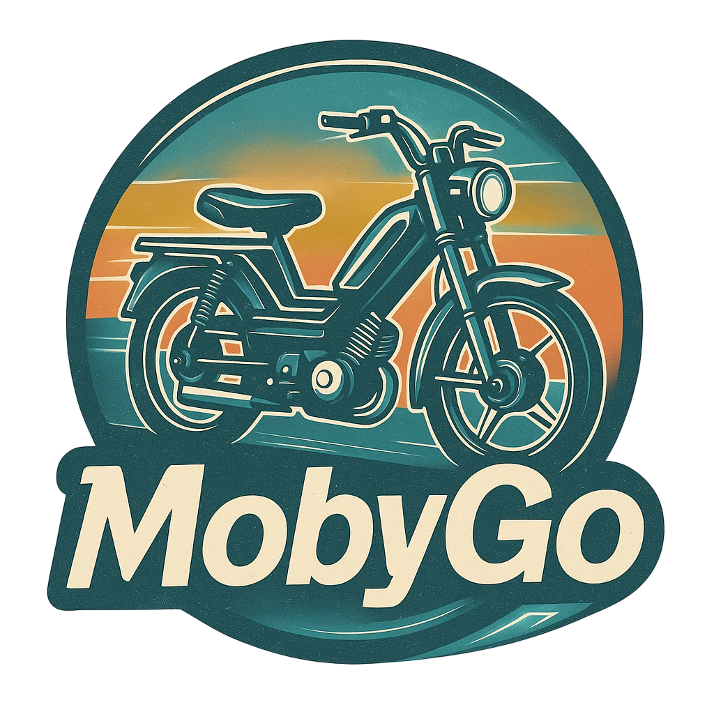
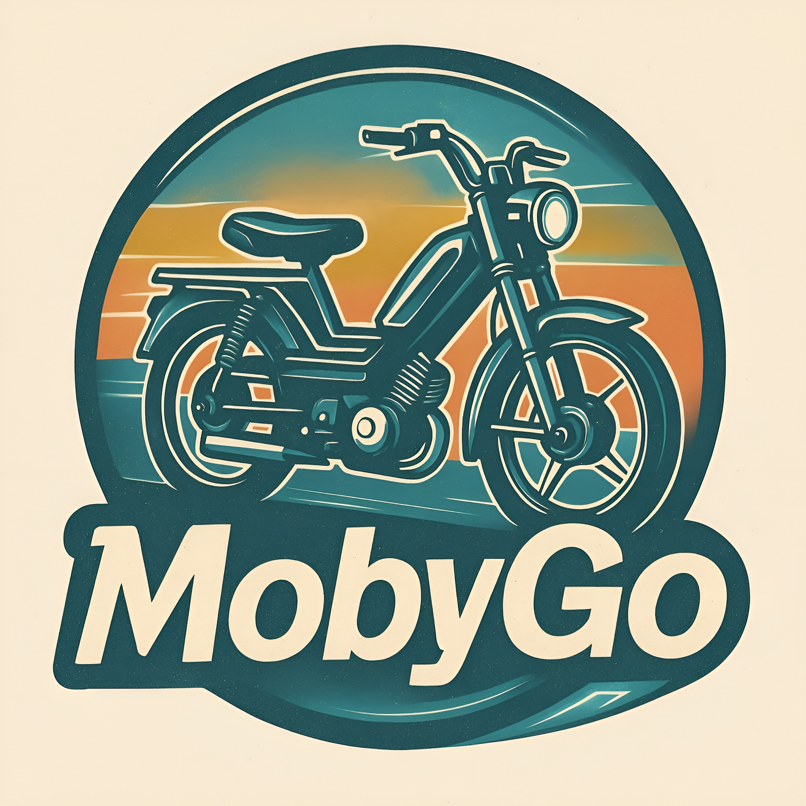

# 📱 App Mob

## Objectif

Une application mobile dédiée aux passionnés de mobylette, permettant de planifier, suivre, partager et vivre des balades en groupe ou en solo.

## Comment l'appeler ?

**MobyTrip**

- __Phrase d’accroche :__ *“Partez à l’aventure, guidé par votre mobylette.”*
- __Description :__ L’application idéale pour planifier, partager et suivre vos balades en mobylette, avec cartes, itinéraires et souvenirs.

**MobyTrax**

- __Phrase d’accroche :__ *“Suivez la trace de vos plus belles balades.”*
- __Description :__ Tracez, enregistrez et partagez vos itinéraires en mobylette, avec suivi GPS et avis de la communauté.

<table>
  <tr>
    <td>
      
    </td>
    <td>
      
    </td>
  </tr>
</table>

**MobyGo**

- __Phrase d’accroche :__ *“Votre compagnon de route pour chaque escapade.”*
- __Description :__ L’appli simple et rapide pour organiser vos balades en mobylette, trouver des itinéraires et rouler en toute liberté.

<table>
  <tr>
    <td>
      
    </td>
    <td>
      
    </td>
  </tr>
</table>

## Fonctionnalités

### 🔐 Authentification

- [ ] Inscription
  - [ ] Email
  - [ ] Facebook
  - [ ] Google
  - [ ] Microsoft
  - [ ] Apple 
- [ ] Connexion
  - [ ] Email
  - [ ] Facebook
  - [ ] Google
  - [ ] Microsoft
  - [ ] Apple 
- [ ] Mot de passe oublié

### 👤 Gestion du compte

- [ ] Modifier le profil
  - [ ] Ajouter / supprimer / modifier la photo de profil
  - [ ] Changer l’email
  - [ ] Changer le mot de passe
  - [ ] Supprimer le compte
- [ ] Gérer les comptes liés
  - [ ] Lier un compte
    - [ ] Facebook
    - [ ] Google
    - [ ] Microsoft
    - [ ] Apple 
  - [ ] Délier un compte
    - [ ] Facebook
    - [ ] Google
    - [ ] Microsoft
    - [ ] Apple 

### 🗺️ Itinéraires

- [ ] Créer un itinéraire
- [ ] Modifier un itinéraire
  - [ ] Départ
  - [ ] Arrivée
  - [ ] Étapes
  - [ ] Ajouter des alertes (ex. : attention graviers)
- [ ] Supprimer un itinéraire
- [ ] Partager un itinéraire
  - [ ] Public
  - [ ] Privé (via lien)
- [ ] Ajouter un itinéraire aux favoris
- [ ] Participer à un itinéraire public en solo
  - [ ] Démarrer l’itinéraire
  - [ ] Voir qui l’a déjà fait (si public)
  - [ ] Ajouter un avis / des médias (photos, vidéos)

### 🚲 Balades (activités en groupe)

- [ ] Créer une balade
  - [ ] Ajouter une date et une heure
  - [ ] Ajouter un lieu de départ
  - [ ] Ajouter un nom
  - [ ] Ajouter une description
  - [ ] Lier un itinéraire existant (optionnel)
    - [ ] Sélectionner un itinéraire public ou perso
    - [ ] Modifier localement (point de départ, alertes, etc.)
- [ ] Gérer une balade
  - [ ] Modifier le nom
  - [ ] Modifier la description
  - [ ] Supprimer la balade
- [ ] Partager une balade
  - [ ] Public
  - [ ] Privé (via lien)

### 🎯 Participer à une balade ou suivre un itinéraire

- [ ] Rejoindre une balade publique ou via lien
  - [ ] Voir les infos : lieu, date, heure, itinéraire associé
  - [ ] S’inscrire / confirmer sa présence
- [ ] Lancer une activité (balade ou itinéraire)
  - [ ] Enregistrement des vitesses (heatmap)
  - [ ] Tracé GPS
  - [ ] Ajouter des médias (photos, vidéos)
    - [ ] Visibles par tous si l’activité est publique
    - [ ] Visibles uniquement par les personnes avec qui elle est partagée

### 📃 Listes et navigation

- [ ] Afficher la liste des itinéraires publics
- [ ] Afficher la liste des balades publiques
- [ ] Afficher la liste des itinéraires privés (rejoints)
- [ ] Afficher la liste des balades privées (rejointes)
